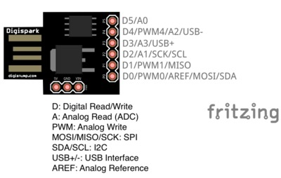

# HW-Watchdog

## Dependencies

```pip install pyusb argparse```

#### Used pin-outs



| Digispark ATTiny85    | Value | Function                      |
|:---------------------:|:-----:|:------------------------------|
| D0                    | 0     | IO, PWM0 AREF, MOSI, SDA      |
| D1                    | 1     | IO, PWM1, MISO                |
| D2                    | 2     | IO, A1, SCK, SCL              |
| D3                    | 3     | IO, A3 USB+                   |
| D4                    | 4     | IO, PWM4, A2, USB-            |
| D5                    | 5     | IO, A0                        |
| G                     | -     | Ground                        |
| 5V                    | -     | 5V                            |
| VIN                   | -     |                               |

#### Aditional hardware

